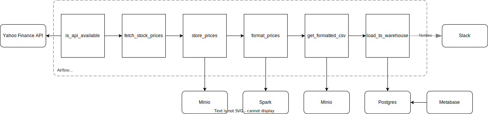

# Stock Market Data Pipeline [WIP]

This project demonstrates a complete data pipeline for fetching, processing, storing, and visualizing stock market data for Apple Inc. (AAPL). The pipeline is built using Apache Airflow, and it integrates with various tools and services to create a robust and scalable data processing workflow.

## Overview

### The primary components of this project include:

	•	Data Ingestion: Fetching stock prices from Yahoo Finance using a Python function.
	•	Data Storage: Storing raw data in MinIO, a local S3-compatible storage service.
	•	Data Processing: Formatting and processing the raw data using Apache Spark.
	•	Data Warehouse: Loading the processed data into a PostgreSQL database.
	•	Data Visualization: Creating dashboards using Metabase.
	•	Notification System: Sending notifications via Slack upon successful pipeline execution.

### Pipeline Workflow

	1.	Verify API Availability: A sensor checks if the Yahoo Finance API is available.
	2.	Fetch Stock Prices: A Python function fetches the stock prices of Apple.
	3.	Store Prices in MinIO: The fetched data is stored in MinIO as a JSON file.
	4.	Format Prices: A Spark job formats the raw data into a structured CSV file.
	5.	Get File Name from MinIO: Retrieve the CSV file name from MinIO.
	6.	Load Data into PostgreSQL: The CSV data is loaded into a PostgreSQL database.
	7.	Build Dashboards: Use Metabase to create visual dashboards on top of the data in PostgreSQL.
	8.	Send Notification: Notify via Slack when the data pipeline succeeds.

## Features

	•	Data Ingestion: Uses Yahoo Finance API to fetch real-time stock prices.
	•	Data Storage: Utilizes MinIO for local storage.
	•	Data Processing: Leverages Apache Spark for data transformation.
	•	Data Warehousing: Employs PostgreSQL for storing processed data.
	•	Data Visualization: Integrates with Metabase for creating dashboards.
	•	Notifications: Implements Slack notifications for pipeline status updates.

## Prerequisites

	•	Docker
	•	Docker Compose
	•	Python 3.8+
	•	Apache Airflow
	•	Apache Spark
	•	MinIO
	•	PostgreSQL
	•	Metabase
	•	Slack Account (for notifications)
